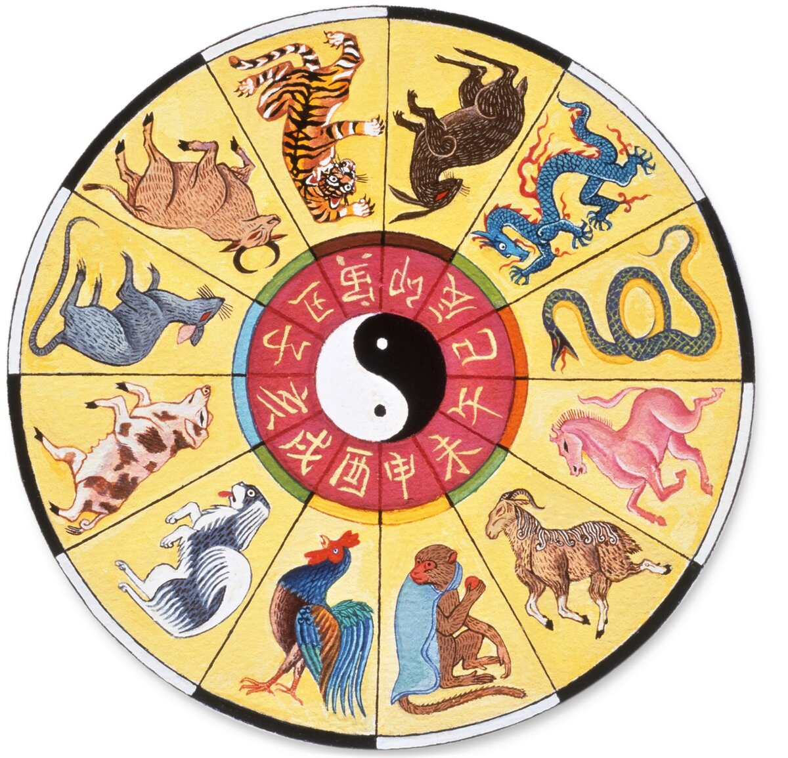

# GWC project

## About it
It my realization [Lloyd's algorithm](https://en.wikipedia.org/wiki/Lloyd%27s_algorithm) with simply graphic header (api written with OpenGL)

In [this](./cppSample/fakeMain.cpp) file you can see realization of Lloyd's algorithm in c and draw it on screen (for now иупшт points fixed and located [here](./cppSample/src.h) with color for each)

## How build and run
### Build
```
$ git clone --recurse-submodules https://github.com/PozhiloyPumba/gwc.git
$ cd gwc
$ cmake -B build -DCMAKE_BUILD_TYPE=Release && cd build
$ cmake --build .
```
### Run
```
$ cmake --build . --target run
```

## Some info about name

<table border="0"><tr>
    <td style="border-style: hidden;">  </td>
    <td style="border-style: hidden;">  </td>
</tr></table>


This repo was create for working with llvm. If we write LLVM (in upper case) we get Roman numbers let's add all of them.
$$L + L + V + M = 50 + 50 + 5 + 1000 = 1105$$
1105 is green wooden cock's (**GWC**) year in chinese calendar. Don’t try to understand how I got to these current ideas.

I'm not crazy (at least I hope)...
